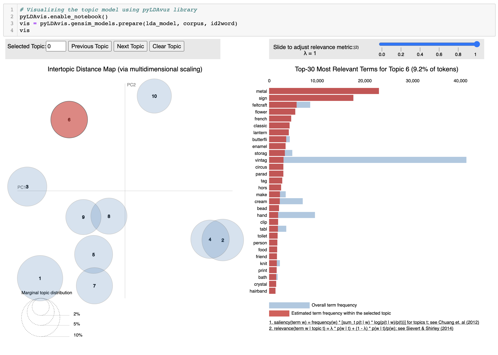

# Evaluating Sales KPI and Product Range Analysis
#### The final project of the Practicum100 Germany Data Analyst Bootcamp. 

### Description
In this project, we were given sales data of 4223 items in a store for a single period (2018-2019).
The dataset contains 541909 rows with 25900 unique invoice numbers, item quantity, and unit price for each item.
We were asked to assess the sales performance by selecting and evaluating relevant key performance indicators (KPI).
The KPI that we selected are:
- Monthly Revenue
- Monthly Sales Growth
- Average Check
- Average Revenue Per Paying User
- Average Revenue per Unit
- Product Performance

In the second part of the project, we evaluate the product range by grouping the items in categories then find which 
products are usually sold
by themselves and in bundles. We used a technique commonly used in NLP 
called Topic Modelling to make the categories. Then we wanted to find 
out whether the items usually sold in bundles generate more revenues 
than those usually sold by themselves.

The last part of the project was to build a simple recommender system 
that can suggest to customers of what items they should purchase next.

### KPI Analysis
After data cleaning, we managed to maintain up to 97% of the original data. Hence, we could continue to analyse the KPIs.
#### Monthly Revenue

Monthly Revenue is the amount of money that we made from the sales 
every month. We get the figure by multiplying the number of items 
sold on each invoice per month by the item's unit price.
~~~python
# Finding the monthly revenue
revenue = clean_data.groupby(['year', 'month']).agg({'revenue':'sum', 'invoice_date':'min'}).reset_index()
revenue['label'] = revenue['invoice_date'].dt.strftime('%Y-%m')
revenue
~~~

#### Percent Growth
Percent Growth shows how much revenue changes every month in percentage 
compared to the previous month's revenue. A positive value means that we earn more income than last month. On the contrary, a negative value means we lost money. The figure is calculated by the change of revenue each month divided by the previous month's income

#### Average check
~~~python
# Finding the number of invoices per month
invoice = (clean_data
           .groupby(['year', 'month', 'invoice_no'])
           .agg({'quantity':'count', 'invoice_date':pd.Series.min})
           .reset_index()
           .query('quantity > 0')
           .groupby(['year', 'month'])
           .agg({'invoice_no':'count', 'invoice_date':'min'})
           .reset_index()
        )
invoice['label'] = invoice['invoice_date'].dt.strftime('%Y-%m')
invoice
~~~

~~~python
# Finding the number of customers per month
customer = (clean_data
            .groupby(['year', 'month', 'customer_id'])
            .agg({'invoice_no':'count', 'invoice_date':'min'})
            .reset_index()
            .query('invoice_no > 0')
            .groupby(['year', 'month'])
            .agg({'customer_id':'count', 'invoice_date':'min'})
            .reset_index()
            )
customer['label'] = customer['invoice_date'].dt.strftime('%Y-%m')
customer
~~~

~~~python
# Merging the dataframes
check = pd.merge(invoice, customer, on=['year', 'month','label', 'invoice_date'], how='left')
check.columns = ['year', 'month', 'n_invoice', 'invoice_date', 'label', 'n_customer']

# Calculating the average check
check['check'] = check['n_invoice']/check['n_customer']
check
~~~

#### ARPPU
~~~python
arppu = pd.merge(revenue, customer, on=['year', 'month', 'invoice_date', 'label'], how='left')
arppu.columns = ['year', 'month', 'revenue', 'invoice_date', 'label', 'growth', 'color', 'n_customer']
arppu['arppu'] = arppu['revenue']/arppu['n_customer']
arppu
~~~

#### ARPU
~~~python
# Merging the dataframes and calculating the ARPU
arpu = pd.merge(quantity, revenue, on=['year', 'month', 'invoice_date', 'label'], how='left')
arpu['arpu'] = arpu['revenue']/arpu['quantity']
arpu
~~~

#### Product Performance
chart 1
chart 2
chart 3

~~~python
# Merging the dataset
kpi = pd.merge(arppu, check, on=['year', 'month', 'invoice_date', 'n_customer', 'label'], how='left')
kpi = pd.merge(kpi, arpu, on=['year', 'month', 'invoice_date', 'label', 'growth', 'color', 'revenue'], how='left')

# Rearranging the columns
kpi = kpi[['year', 
             'month', 
             'invoice_date', 
             'label', 
             'n_customer', 
             'revenue', 
             'growth', 
             'n_invoice', 
             'quantity', 
             'check', 
             'arppu', 
             'arpu']]
kpi.head()
~~~

We have calculated the monthly revenue, monthly growth, average check, average revenue per paying user (ARPPU), average revenue per unit (ARPU), and product performance. From the indicators, we learned that the sales performed very well; it scored 5.3% growth in December 2018 and kept growing until November 2019 where it reached the highest revenue of 1,483,943. The average revenue per paying unit (ARPPU) also scored the highest this month, with 1891 points. However, the following month showed an interesting phenomenon where sales dropped -0.66% and only earned 507,470. The average check and ARPPU also present a similar trend. The ARPU, on the other hand, is relatively steady throughout the year, with an average of 2.21 points. We have also displayed the top 3, 10, and 25 products based on revenue in the last section of this analysis.

In November 2019, most of our customers bought Christmas decorations, which boost revenue. Furthermore, it also explains why the revenue dropped drastically in the following month.

## Product Range Analysis

[Dashboard](https://public.tableau.com/app/profile/widianto.persadha/viz/KPI_16275523309270/Dashboard?publish=yes)

